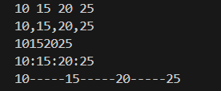
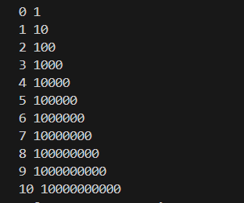
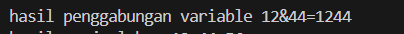
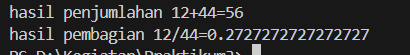
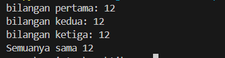
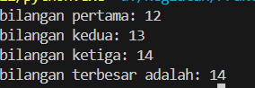
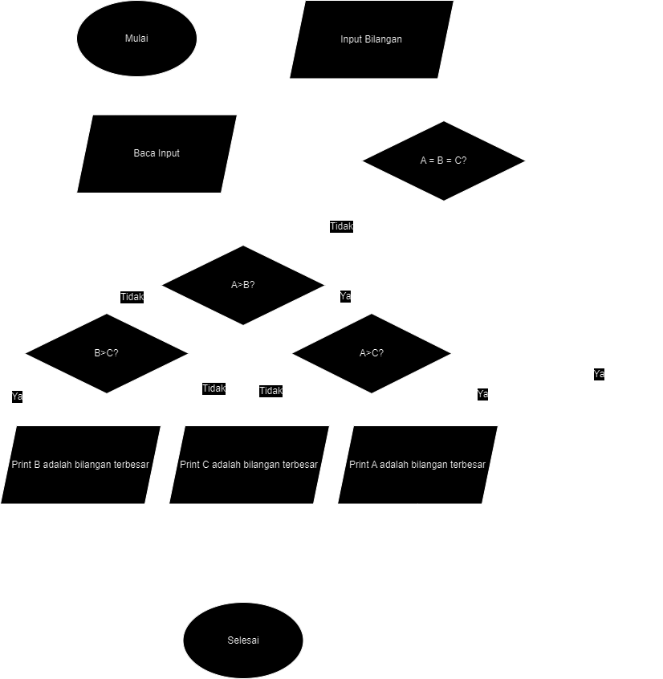
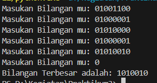
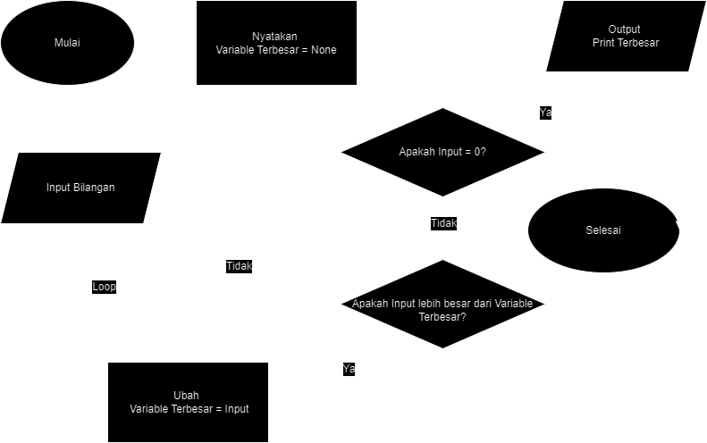

# Praktikum3

adanya repositori ini adalah untuk memenuhi tugas yang diberikan kepada saya.

Di sini, saya akan menjelaskan pengkodean yang ada dalam repositori ini.

# Daftar Isi

1. [Latihan 1](#L1)
2. [Latihan 2](#L2)
3. [Terbesar dari 3 Bilangan](#3B)
4. [Terbesar dari N Bilangan](#NB)

## Latihan 1 <a name="L1"></a>

1. Penggunaan ```end```
```ruby
print('A',end=' ')
print('B',end=' ')
print('C',end=' ')
print()
print('X')
print('Y')
print('Z')
```
```end=' '``` di sini berfungsi untuk mengganti akhiran ```print()```, yang tadinya membuat baris baru setiap kali digunakan menjadi memberikan spasi setiap kali digunakan.
Hasilnya:


2. Penggunaan ```Separator```
```ruby
w,x,y,z=10,15,20,25
print(w,x,y,z)
print(w,x,y,z,sep=',')
print(w,x,y,z,sep='')
print(w,x,y,z,sep=':')
print(w,x,y,z,sep='-----')
```
```sep=``` ini akan memberikan pemisah diantara setiap nilai yang akan di cetak.
Hasilnya:



3. Penghitungan Kuadrat
```ruby
print(0, 10**0)
print(1, 10**1)
print(2, 10**2)
print(3, 10**3)
print(4, 10**4)
print(5, 10**5)
print(6, 10**6)
print(7, 10**7)
print(8, 10**8)
print(9, 10**9)
print(10, 10**10)
```
Hasilnya:



4. String Format
```ruby
print('{0:>3} {1:>16}'.format(0, 10**0))
print('{0:>3} {1:>16}'.format(1, 10**1))
print('{0:>3} {1:>16}'.format(2, 10**2))
print('{0:>3} {1:>16}'.format(3, 10**3))
print('{0:>3} {1:>16}'.format(4, 10**4))
print('{0:>3} {1:>16}'.format(5, 10**5))
print('{0:>3} {1:>16}'.format(6, 10**6))
print('{0:>3} {1:>16}'.format(7, 10**7))
print('{0:>3} {1:>16}'.format(8, 10**8))
print('{0:>3} {1:>16}'.format(9, 10**9))
print('{0:>3} {1:>16}'.format(10, 10**10))
```
Di sini ```format()``` digunakan untuk mengatur posisi output.
Hasilnya:


## Latihan 2 <a name="L2"></a>

1. Pada bagian ini
```ruby
a = input("masukan nilai a: ") 
b = input("masukan nilai b: ") 
```
Python akan mengambil ```input()``` dari Pengguna, apapun yang di ```input()``` akan disimpan sebagai string di dalam variable ```a``` & ```b```.

2. Selanjutnya
```ruby
print("variable a =", a)
print("variable b =", b)
```
Python akan menampilkan nilai variable ```a``` & ```b``` yang baru saja dimasukuan oleh Pengguna.


3. Di sini
```ruby
print("hasil penggabungan variable {}&{}={}".format(a, b, a+b)) 
```
Python akan menggabungkan 2 variable dan menampilkannya ke pengguna. 
<small> ini bukanlah penjumlahan <small>


4. Lalu 
```ruby
a = int(a)
b = int(b)
```
Disini Python akan mengubah nilai variable ```a``` & ```b``` menjadi ```int()``` integer.

5. Terakhir
```ruby
print("hasil penjumlahan {}+{}={}".format(a, b, a+b))
print("hasil pembagian {}/{}={}".format(a, b, a/b if a != 0 else "undefined"))
```
Python akan melakukan Aritmatika Penjumlahan dan Pembagian yang kemudian akan ditampilkan ke Pengguna.


## Mencari yang Terbesar dari 3 Bilangan <a name="3B"></a>

1. Menginputkan Bilangan 
```ruby
a = int(input("bilangan pertama: "))
b = int(input("bilangan kedua: "))
c = int(input("bilangan ketiga: "))
```
Pengguna akan diminta untuk ```input()``` bilangan, kemudian ```input()``` itu akan dikonversikan menjadi ```int()``` integer.

2. Mendefinisikan Fungsi
```ruby
def terbesar(a, b, c):
```

3. Pengecekan
```ruby
    if a == b == c:
        print(f"Semuanya sama {a}")
```
Apakah semua bilangan sama? Jika iya, maka ``` Semuanya sama ``` akan ditampilkan. 



4. Pengecekan ke 2
```ruby
    else:
        terbesar = max(a, b, c)
        print(f"bilangan terbesar adalah: {terbesar}")
```
Pengecekan akan berlanjut ke tahap ke-2 jika semua bilangan berbeda.



5. Memanggil Fungsi
```ruby
terbesar(a, b, c) 
```
Gunanya adalah untuk mengeksekusi fungsi tersebut.

Berikut adalah Flowchart untuk Kode ini:



## Mencari yang Terbesar dari N Bilangan <a name="NB"></a>

1. Inisialisasi Variabel
```ruby
terbesar = None
``` 
Di awal-awal, variable ``` terbesar ``` akan di definisikan dengan nilai None.

2. Memulai Perulangan
```ruby
while True:
    n = int(input("Masukan Bilangan mu: "))
``` 
Bagian ini akan terus berulang, berulang dan berulang.

3. Pengecekan
```ruby
    if n == 0:
        break
``` 
Setelah Pengguna melakukan ``` input ``` akan dilakukan pengecekan, apakah bilangan itu adalah 0? Jika benar, maka perulangan akan dihentikan.

4. Pemeriksaan
```ruby
    if terbesar is None or n > terbesar:
        terbesar = n
``` 
Jika bilangan tersebut bukan 0, akan dilakukan perbandingan antara ``` input ``` dengan nilai yang ada di variable ``` terbesar ```. Dan jika ``` input ``` bernilai lebih besar dari variable ``` terbesar ``` maka nilai ``` terbesar ``` akan diperbaruii.

5. Output
```ruby
print("Bilangan Terbesar adalah:", terbesar)
``` 
Ini untuk mencetak hasil dari perbandingan, dengan mengambil nilai variable ``` terbesar ```.

Hasilnya:



Flowchart untuk Code ini:

