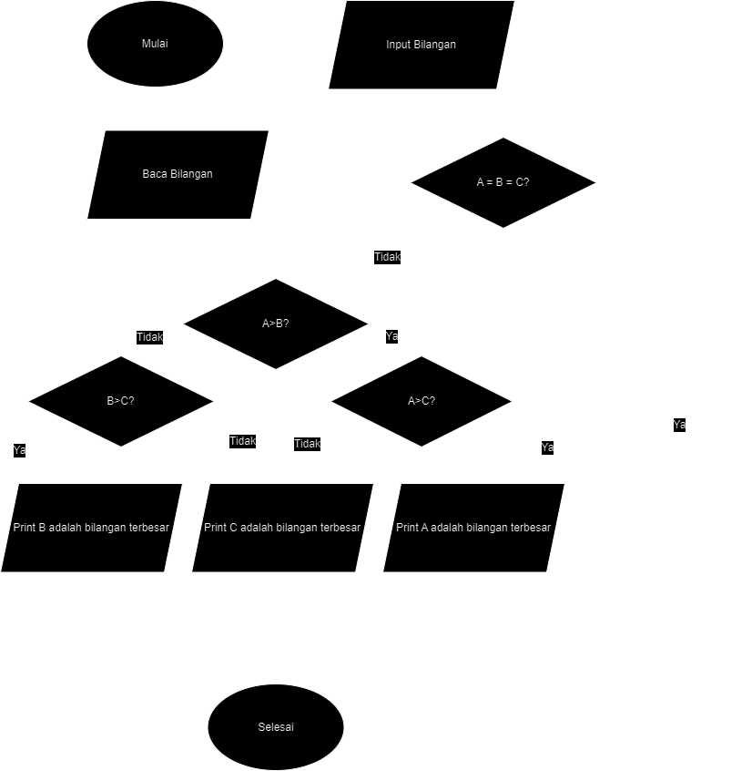

# Praktikum3

adanya repositori ini adalah untuk memenuhi tugas yang diberikan kepada saya.

Di sini, saya akan menjelaskan pengkodean yang ada dalam repositori ini.

# Daftar Isi

1. [Latihan 1](#L1)
2. [Latihan 2](#L2)
3. [Terbesar dari 3 Bilangan](#3B)
4. [Terbesar dari N Bilangan](#NB)

## Latihan 1 <a name="L1"></a>

1. Penggunaan ```end```
```ruby
print('A',end=' ')
print('B',end=' ')
print('C',end=' ')
print()
print('X')
print('Y')
print('Z')
```
```end=' '``` di sini berfungsi untuk mengganti akhiran ```print()```, yang tadinya membuat baris baru setiap kali digunakan menjadi spasi.
Hasilnya:


2. Penggunaan ```Separator```
```ruby
w,x,y,z=10,15,20,25
print(w,x,y,z)
print(w,x,y,z,sep=',')
print(w,x,y,z,sep='')
print(w,x,y,z,sep=':')
print(w,x,y,z,sep='-----')
```
```sep=``` ini akan memberikan pemisah diantara setiap nilai yang akan di cetak.
Hasilnya:


3. Penghitungan Kuadrat
```ruby
print(0, 10**0)
print(1, 10**1)
print(2, 10**2)
print(3, 10**3)
print(4, 10**4)
print(5, 10**5)
print(6, 10**6)
print(7, 10**7)
print(8, 10**8)
print(9, 10**9)
print(10, 10**10)
```
Hasilnya:


4. String Format
```ruby
print('{0:>3} {1:>16}'.format(0, 10**0))
print('{0:>3} {1:>16}'.format(1, 10**1))
print('{0:>3} {1:>16}'.format(2, 10**2))
print('{0:>3} {1:>16}'.format(3, 10**3))
print('{0:>3} {1:>16}'.format(4, 10**4))
print('{0:>3} {1:>16}'.format(5, 10**5))
print('{0:>3} {1:>16}'.format(6, 10**6))
print('{0:>3} {1:>16}'.format(7, 10**7))
print('{0:>3} {1:>16}'.format(8, 10**8))
print('{0:>3} {1:>16}'.format(9, 10**9))
print('{0:>3} {1:>16}'.format(10, 10**10))
```
Di sini ```format()``` digunakan untuk mengatur posisi output.


## Latihan 2 <a name="L2"></a>

1. Pada bagian ini
```ruby
a = input("masukan nilai a: ") 
b = input("masukan nilai b: ") 
```
Python akan mengambil Input dari Pengguna, apapun yang di Input akan disimpan sebagai string di dalam variable ```a``` & ```b```.

2. Selanjutnya
```ruby
print("variable a =", a)
print("variable b =", b)
```
Python akan menampilkan nilai variable ```a``` & ```b``` yang baru saja dimasukuan oleh Pengguna.


3. Pada bagian ini
```ruby
print("hasil penggabungan variable {}&{}={}".format(a, b, a+b)) 
```
Python akan menggabungkan 2 variable dan menampilkannya ke pengguna. 
<small> ini bukanlah penjumlahan <small>


4. Lalu 
```ruby
a = int(a)
b = int(b)
```
Disini Python akan mengubah nilai variable ```a``` & ```b``` menjadi integer.

5. Terakhir
```ruby
print("hasil penjumlahan {}+{}={}".format(a, b, a+b))
print("hasil pembagian {}/{}={}".format(a, b, a/b if a != 0 else "undefined"))
```
Python akan melakukan Aritmatika Penjumlahan dan Pembagian yang kemudian akan ditampilkan ke Pengguna.


## Mencari yang Terbesar dari 3 Bilangan <a name="3B"></a>


## Mencari yang Terbesar dari N Bilangan <a name="NB"></a>

